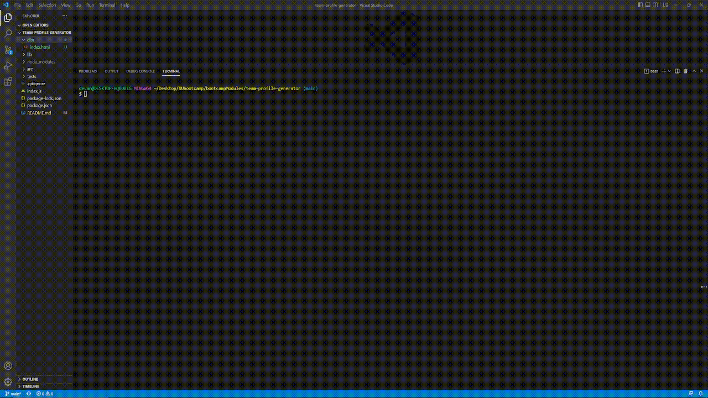

# Object-Oriented Programming - Team Profile Generator

## Description
A Node.js command-line application that takes in information about employees on a software engineering team, then generates an HTML webpage that displays summaries for each person.
  
## Table of Contents
- [Installation](#installation)
- [Usage](#usage)
- [Credits](#credits)
- [License](#license)

## Installation
In order to use this application, [node.js](https://nodejs.org/en/) and the [npm inquirer](https://www.npmjs.com/package/inquirer/v/8.2.4) package must be installed.

## Usage 
In order to use this application, the user must run the application using node.js in the command line. It will then prompt the user with questions to fill out for their software engineering team profile.

---

Video walkthrough of tests

---

Video walkthrough of working application

## Credits
While working on this project, I worked alongside Jackson Myhre in the same bootcamp class. And used the following libraries:
- [node.js](https://nodejs.org/en/)
- [npm inquirer](https://www.npmjs.com/package/inquirer/v/8.2.4)

## License
Licensed by The Unlicense
